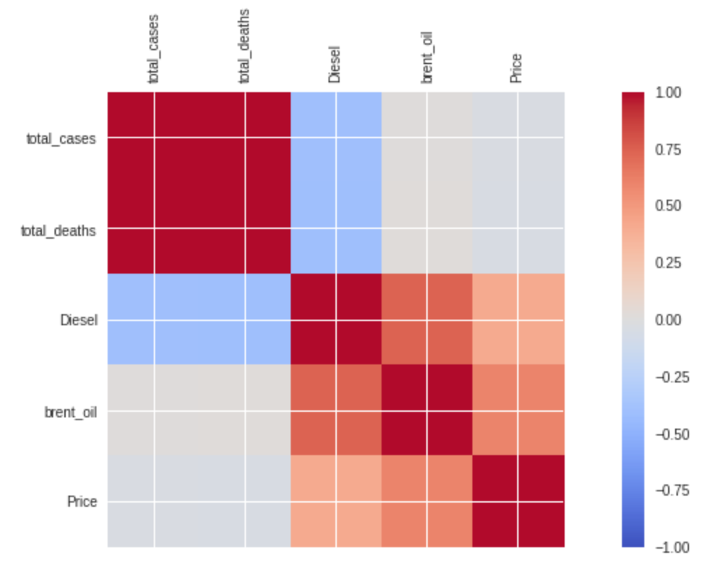

# Exploring the effect of COVID-19 fatality rates on the Foreign Exchange Spot Price of a currency pair (GBP/USD) through shallow and deep learning neural networks

## How to use:
*	Open each file using google colab
*	Each model will let you know what datasets to import before running the model
*	[Our World In Data Dataset](https://github.com/owid/covid-19-data/tree/master/public/data) is used. 
*	GBP/USD dataset provided by [investing.com](https://uk.investing.com/currencies/gbp-usd)
*	Limitations: The fuel_prices_com.csv file was donated by [GlobalPetrolPrices.com](https://www.globalpetrolprices.com/) for this study therefore this will not be included in this repository however this dataset can be purchased on their website.

## 1. Experiments

### Shrinkage Models:
*	Simple Linear Regression
*	Ridge Regression
*	Lasso Regression
*	ElasticNet Regression

### Ensemble Regression:
*	Simple Linear Regression
*	Support Vector Regression
*	Random Forest Regression
*	Gradient Boosting 

### Additional SMA/SLR (Unreported):
*	Simple Moving Average (SMA) model
*	Simple Linear Regression model

## 2. Correlation:
*	Correlation
*	Variance Inflation Factor

## 3. SLR
### SLR/MLR:
*	Model 1: Simple Linear Regression (Spot Price)
*	Model 2: Simple Linear Regression (COVID-19 -> Diesel)
*	Model 3: Simple Linear Regression (Diesel -> Forex Spot Price)
*	Model 4: Multi-Linear Regression (All data i.e. COVID-19, Diesel & Forex Spot Price -> Forex Spot Price)
* 	Additional (Unreported):
 	- Simple Linear Regression (COVID-19 Deaths)

## 4. LSTM
### LSTM Models: 
*	Model 1: Univariate LSTM (Spot Price)
*	Model 2: Multivariate LSTM (COVID-19 -> Diesel)
*	Model 3: Multivariate LSTM (Diesel -> Forex Spot Price)
*	Model 4: Multivariate LSTM (All data i.e. COVID-19, Diesel & Forex Spot Price -> Forex Spot Price)
*	Additional (Unreported):
	- Univariate LSTM (COVID-19 Deaths)

## 5. CNN
### CNN Models: 
*	Model 1: Univariate CNN (Spot Price)
*	Model 2: Multivariate CNN (COVID-19 -> Diesel)
*	Model 3: Multivariate CNN (Diesel -> Forex Spot Price)
*	Model 4: Multivariate CNN (All data i.e. COVID-19, Diesel & Forex Spot Price -> Forex Spot Price)
*	Additional (Unreported):
	- Univariate CNN (COVID-19 Deaths)

